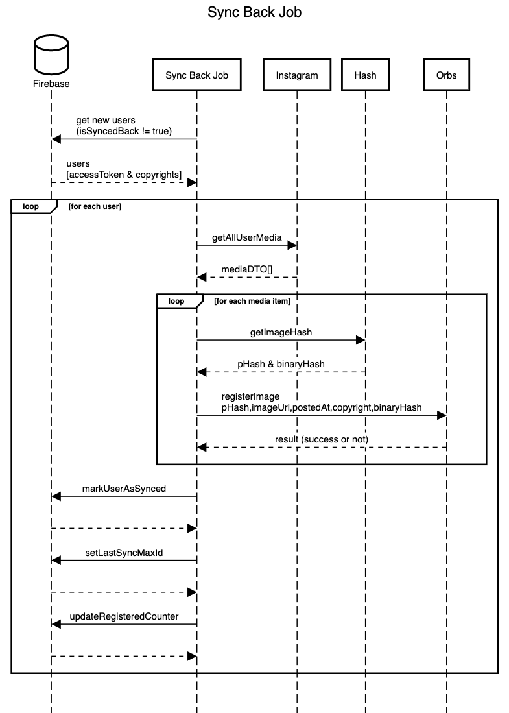
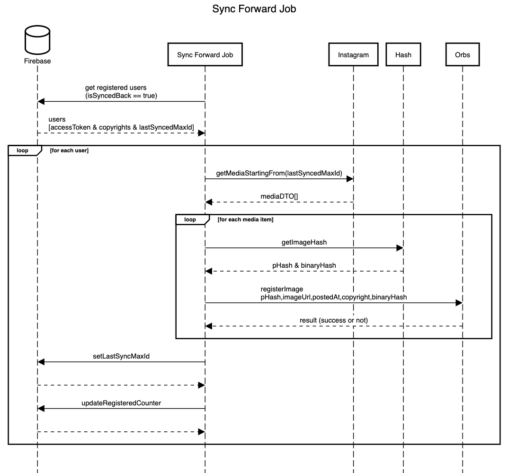

# Jobs

There are 2 jobs running:  
**SyncBackJob** - syncing photos for new users from the moment of registering to the service. The most amount of images; 
**SyncForward** - After SyncBack Job is done, SyncForward Job syncs newly uploaded images by user if any.

